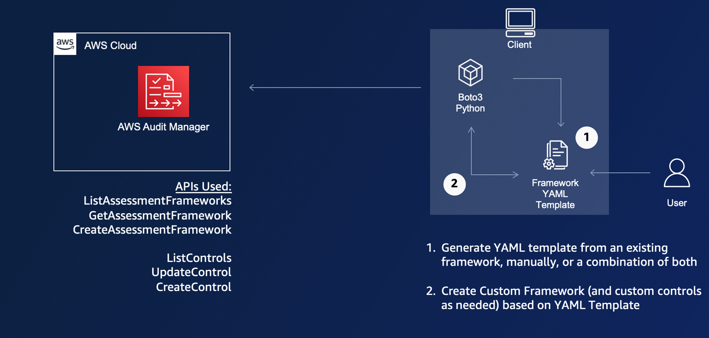

# Custom Audit Manager Controls and Frameworks

## Building custom frameworks on AWS Audit Manager
The AWS Audit Manager framework library is the central place from which you can access and manage frameworks. You can create custom frameworks to organize controls into control sets in a way that suits your unique requirements. In this session, builders will get an opportunity to build a customized framework through Management Console. Additionally, they can learn from customer use cases to use automation using AWS SDK for Python to build custom frameworks at scale.


### Automation Architecture


## customFramework.py Function
### customFramework.py Arguments

| Argument                          | Purpose                                                                                                       | Allowed Values                                                                                                       |
|-----------------------------------|---------------------------------------------------------------------------------------------------------------|----------------------------------------------------------------------------------------------------------------------|
| [--jobName JOB_NAME]              | Provide customFramework instructions for the type of automation job you want to perform.                      | Custom-Standard-Framework,   Automated-Custom-Framework, Merge-Multiple-Framework, Generate-YAML-Framework           |
| [—customFrameworkName CUSTOM_REPORT_NAME]  | The name of the custom framework created as a result of this job.                                             | Must be unique                                                                                                       |
| [—existingFrameworkName REPORT_NAME]               | The name of an existing framework. This is used for jobs that lookup a framework and extract control details. |                                                                                                                      |
| [—description DESCRIPTION]        | An optional description for the new custom framework                                                          |                                                                                                                      |
| [—compliance-type COMPLIANCETYPE] | An optional description for the compliance type that the new custom framework supports, such as CIS or HIPAA. |                                                                                                                      |
| [—template-path FILEPATH]         | Path to the file containing the template body for the control sets in either JSON or YAML                     |                                                                                                                      |
| --regions REGIONS                 | List of regions to deploy custom framework into separated by a single ','                                     |                                                                                                                      |
| [-v]                              | enables verbose logging for troubleshooting                                                                   |                                                                                                                      ||


### CustomFramework Job Functionality 
#### Custom-Standard-Framework
Description
This job will create new custom controls and a new custom framework that consists of those custom controls.  The controls are expressed via a YAML file and the repo includes an example if you wanted to build a framework for automated assessment of Amazon S3

Example Test String
```
$ python customFramework.py --jobName Custom-Standard-Framework --customFrameworkName "S3 Controls Framework" --description "Automated AWS Config Controls for Amazon S3" --compliance-type "AWS Service" --template-path "frameworks/s3_config_framework.yaml" --regions "us-east-1"
```

#### Automated-Custom-Framework
**Description**

This job will accept Audit Manager Managed Framework names https://docs.aws.amazon.com/audit-manager/latest/userguide/framework-overviews.html and create a new custom framework that consists of only the automated controls from the managed framework.

Example Test String
```
$ python customFramework.py --jobName Automated-Custom-Framework --regions "us-east-1" --existingFrameworkName "PCI DSS V3.2.1" --customFrameworkName "PCI DSS V3.2.1 - Automated Controls Only" 
```


#### Merge-Multiple-Framework
**Description**

This job will create a custom framework in Audit Manager by merging multiple frameworks.  The frameworks' control sets are identified in a provided YAML template.


Example Test String
```
$ python customFramework.py --jobName Merge-Multiple-Framework --regions "us-east-1" --customFrameworkName "Custom Enterprise Controls"  --template-path "frameworks/multi_framework.yaml"
```
#### Generate-YAML-Automatic-Framework
**Description**
This job will create a YAML file formatted for a custom framework template from one or more existing frameworks.  You can then modify that YAML template to add or remove additional controls.  Once the complete, you can use it to generate a custom framework based on this template.


Example Test String
```
$ python customFramework.py --jobName Generate-YAML-Framework --existingFrameworkName "AWS License Manager" --template-path "frameworks/license_manager_controls.yaml" --regions "us-east-1"
```


# Builders Session Steps
## Prerequisites

1. Have an AWS account with Audit Manager enabled
2. Confirm you have an environment to make AWS API calls with. (Cloud9 or local)
3. Clone the provided sample code to your working environment (local computer or cloud9) (LINK)
4. Ensure you have updated Python (Specifically version 3.5 or higher), Boto3, pyyaml, and Botocore installed in the environment. You can also run below command to install these libraries:
```
pip install -r requirements.txt
```

## Create a Custom Framework in the Audit Manager UI

1. Log into the AWS console and navigate to Audit Manager
2. Navigate to the framework library and create a custom framework.
3. Upon completion you should have made a custom framework either from scratch of using one of the prebuilt frameworks as a template.

## Create a Custom Framework using the automation provided

1. Use the "customFramework" function and the correct job name to begin creating a standard custom framework.
2. Look at example test string in code repo for command arguments.
3. After the Python script has completed check in the console to see if your new custom framework appears.

## Create a Custom Framework with only automated controls from an AWS Managed Framework

1. Use the "customFramework" function and the correct job name to begin creating a custom framework for automated controls.
2. Look at example test string in code repo for command arguments.
3. After the Python script has completed check in the console to see if your new custom framework appears.

## Merge any two frameworks into a new Custom Framework.

1. Use the "customFramework" function an the correct job name to begin creating a custom framework from multiple frameworks.
2. Look at example test string in code repo for command arguments.
3. After the Python script has completed check in the console to see if your new custom framework appears.

## Generate a YAML template from an existing framework, manually update it with additional controls, and create a new Custom Framework based on that.

1. Use the "customFramework" function and the Generate-YAML-Framework job name to create a YAML framework.
2. Once the Python script finishes find the name YAML file in the local copy of the repo.
3. Use the Python tool to generate a custom framework with your newly generated YAML file.
4. After the Python script has completed check in the console to see if your new custom framework appears.
